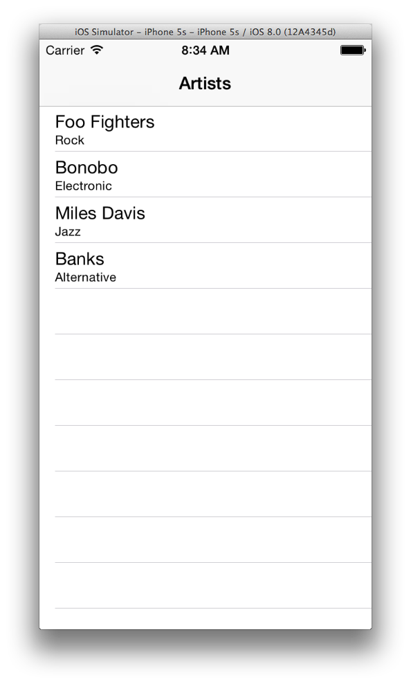
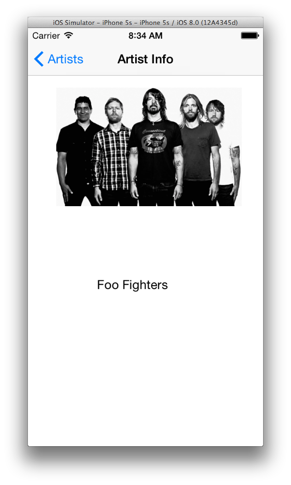

MusicApp-Swift
==============

Learnng Swift with a sample iOS app for tracking favourite bands and finding out more info about them and where they're touring

## Dependencies

* [Xcode 6 Beta 6] (http://developer.apple.com)

## Team

* Development: [Shagun Madhikarmi](mailto:madhikarma@gmail.com?subject=musicapp-swift)

## TODO

* Add dynamic artists entry
* Add artist info
* Add artist tour info

#### Screenshots

